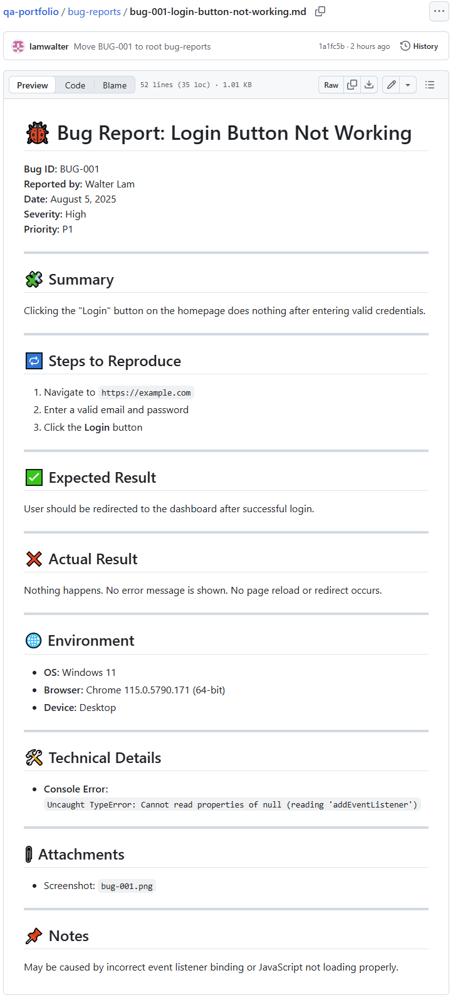

# 🐞 Bug Report: Login Button Not Working

**Bug ID:** BUG-001  
**Reported by:** Walter Lam  
**Date:** August 5, 2025  
**Severity:** High  
**Priority:** P1  

---

## 🧩 Summary
Clicking the "Login" button on the homepage does nothing after entering valid credentials.

---

## 🔁 Steps to Reproduce
1. Navigate to `https://example.com`
2. Enter a valid email and password
3. Click the **Login** button

---

## ✅ Expected Result
User should be redirected to the dashboard after successful login.

---

## ❌ Actual Result
Nothing happens. No error message is shown. No page reload or redirect occurs.

---

## 🌐 Environment
- **OS:** Windows 11  
- **Browser:** Chrome 115.0.5790.171 (64-bit)  
- **Device:** Desktop

---

## 🛠️ Technical Details
- **Console Error:**  
  `Uncaught TypeError: Cannot read properties of null (reading 'addEventListener')`

---

## 📎 Attachments
- Screenshot: 

---

## 📌 Notes
May be caused by incorrect event listener binding or JavaScript not loading properly.
