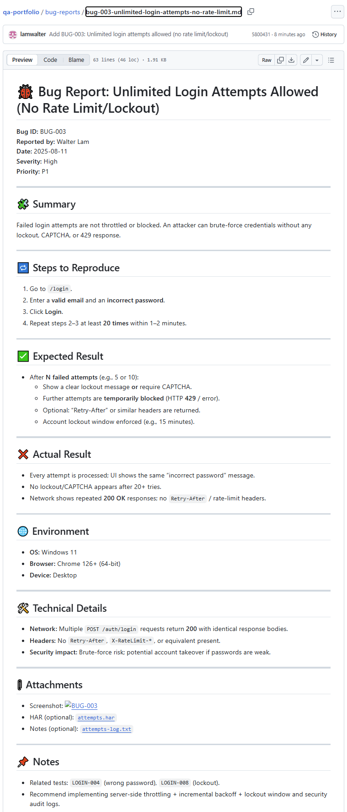

# 🐞 Bug Report: Unlimited Login Attempts Allowed (No Rate Limit/Lockout)

**Bug ID:** BUG-003  
**Reported by:** Walter Lam  
**Date:** 2025-08-11  
**Severity:** High  
**Priority:** P1

---

## 🧩 Summary
Failed login attempts are not throttled or blocked. An attacker can brute-force credentials without any lockout, CAPTCHA, or 429 response.

---

## 🔁 Steps to Reproduce
1. Go to `/login`.
2. Enter a **valid email** and an **incorrect password**.
3. Click **Login**.
4. Repeat steps 2–3 at least **20 times** within 1–2 minutes.

---

## ✅ Expected Result
- After **N failed attempts** (e.g., 5 or 10):
  - Show a clear lockout message **or** require CAPTCHA.
  - Further attempts are **temporarily blocked** (HTTP **429** / error).
  - Optional: “Retry-After” or similar headers are returned.
  - Account lockout window enforced (e.g., 15 minutes).

---

## ❌ Actual Result
- Every attempt is processed; UI shows the same “incorrect password” message.
- No lockout/CAPTCHA appears after 20+ tries.
- Network shows repeated **200 OK** responses; no `Retry-After` / rate-limit headers.

---

## 🌐 Environment
- **OS:** Windows 11  
- **Browser:** Chrome 126+ (64-bit)  
- **Device:** Desktop

---

## 🛠️ Technical Details
- **Network:** Multiple `POST /auth/login` requests return **200** with identical response bodies.  
- **Headers:** No `Retry-After`, `X-RateLimit-*`, or equivalent present.  
- **Security impact:** Brute-force risk; potential account takeover if passwords are weak.

---

## 📎 Attachments
- Screenshot: 
- HAR (optional): [attempts.har](./assets/BUG-003/attempts.har)
- Notes (optional): [attempts-log.txt](./assets/BUG-003/attempts-log.txt)

---

## 📌 Notes
- Related tests: `LOGIN-004` (wrong password), `LOGIN-008` (lockout).  
- Recommend implementing server-side throttling + incremental backoff + lockout window and security audit logs.
