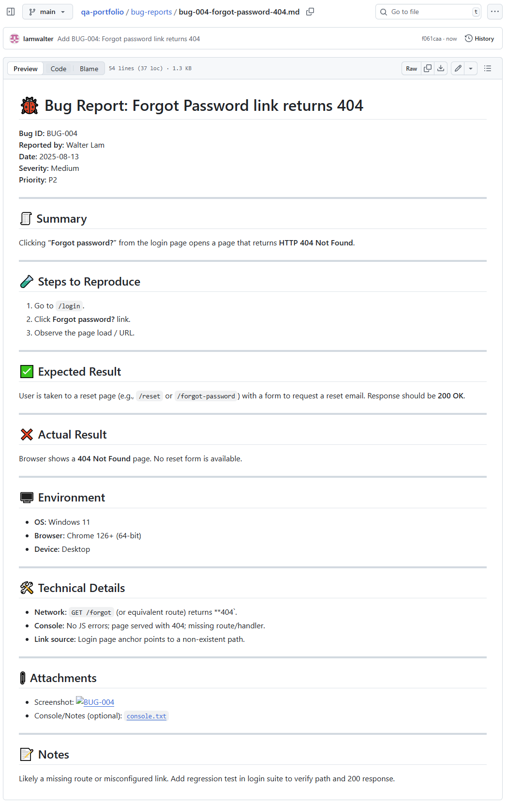

# 🐞 Bug Report: Forgot Password link returns 404

**Bug ID:** BUG-004  
**Reported by:** Walter Lam  
**Date:** 2025-08-13  
**Severity:** Medium  
**Priority:** P2

---

## 🧾 Summary
Clicking **“Forgot password?”** from the login page opens a page that returns **HTTP 404 Not Found**.

---

## 🧪 Steps to Reproduce
1. Go to `/login`.
2. Click **Forgot password?** link.
3. Observe the page load / URL.

---

## ✅ Expected Result
User is taken to a reset page (e.g., `/reset` or `/forgot-password`) with a form to request a reset email. Response should be **200 OK**.

---

## ❌ Actual Result
Browser shows a **404 Not Found** page. No reset form is available.

---

## 🖥️ Environment
- **OS:** Windows 11  
- **Browser:** Chrome 126+ (64-bit)  
- **Device:** Desktop

---

## 🛠️ Technical Details
- **Network:** `GET /forgot` (or equivalent route) returns **404`.  
- **Console:** No JS errors; page served with 404; missing route/handler.  
- **Link source:** Login page anchor points to a non-existent path.

---

## 📎 Attachments
- Screenshot: 
- Console/Notes (optional): [`console.txt`](./assets/BUG-004/console.txt)

---

## 📝 Notes
Likely a missing route or misconfigured link. Add regression test in login suite to verify path and 200 response.
